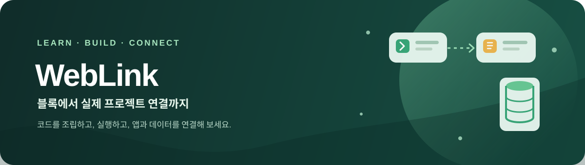
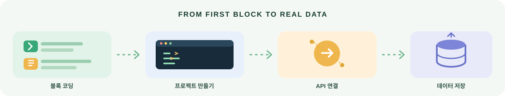

<div align="center">



<h1>WebLink</h1>

**블록 코딩으로 시작해, 실제 앱과 데이터 연결까지**

코드를 배우는 데서 멈추지 않고 프로젝트를 만들고 실행하며 API·데이터베이스·외부 앱을 연결하는 과정을 익히는 교육용 개발 플랫폼입니다.

[시작하기](#-빠른-시작) · [무엇을 할 수 있나요?](#-배우고-만들기) · [프로젝트 현황](docs/PROJECT_STATUS_KO.md)

</div>

<p align="center">
  
  
  
  
  
</p>

## ✨ 배우고 만들기

<p align="center">
  
</p>

| 🧩 블록으로 배우기 | 🛠️ 프로젝트 만들기 | 🔗 연결하며 확장하기 |
| --- | --- | --- |
| 순서가 섞인 코드 블록을 조립하고, 힌트와 함께 Python 기초를 익힙니다. | Monaco 편집기에서 파일을 관리하고, 코드를 실행하며 프로젝트를 저장합니다. | API·SQLite·Google Sheets를 연결해 실제 데이터 흐름을 연습합니다. |

- **실습부터 프로젝트까지** — 학습 내용을 실제 Python 프로젝트에서 실행해 봅니다.
- **바로 실행할 수 있는 예제** — 여러 파일로 구성된 독서 기록 앱에서 SQLite 데이터 저장과 수정 흐름을 살펴봅니다.
- **폴더로 코드 정리하기** — 프로젝트 파일을 폴더로 나누고, 파일을 폴더에 넣거나 루트로 꺼내며 PC의 텍스트 파일과 폴더도 끌어와 구성할 수 있습니다. 폴더 이름 변경과 안의 파일을 포함한 삭제도 지원합니다.
- **함께 이어서 작업하기** — WebLink 계정 이메일로 팀원을 추가해 편집자 또는 보기 전용 권한을 부여하고, 저장된 변경 사항을 공유할 수 있습니다. 다른 팀원의 저장은 내 화면에 자동 반영되며, 저장되지 않은 내 코드가 있을 때는 덮어쓰지 않고 최신 초안 불러오기를 안내합니다. 프로젝트 파일은 ZIP 또는 내 컴퓨터 폴더로 옮겨 GitHub Desktop에서도 관리할 수 있습니다.
- **저장 버전 관리** — 저장 버전에 만든 사람과 날짜를 표시하고, 다른 팀원이 초안을 갱신한 뒤 오래된 화면에서 복원을 시도하면 최신 버전을 다시 확인합니다.
- **프로젝트 관리** — 소유자는 프로젝트 이름·설명과 팀원의 편집/보기 권한을 언제든 변경할 수 있습니다.
- **작업 나누기** — 할 일·진행 중·완료 보드에서 작업의 설명, 담당 팀원, 우선순위와 마감일을 관리할 수 있습니다. 내 작업과 담당자, 우선순위, 마감일로 찾아보고 완료율을 확인하세요. 체크리스트로 세부 단계를 나누고, 작업별 댓글과 변경 기록을 공유하며 최근 활동 알림으로 팀 진행 상황을 따라갈 수 있습니다.
- **안전한 연결 실습** — Google Sheets 읽기 권한과 프로젝트별 데이터베이스를 사용해 데이터 연동 과정을 배웁니다.

> 팀원은 먼저 WebLink 계정에 가입해야 하며 현재 초대 이메일은 발송하지 않습니다. 현재 구현된 기능과 제한사항은 [프로젝트 진행 상황](docs/PROJECT_STATUS_KO.md)에서 확인할 수 있습니다. Google Drive 파일 가져오기와 Google 계정 가입은 아직 구현되지 않았습니다.

## 🚀 빠른 시작

필요한 환경: **Docker Desktop**과 **Git**. 저장소를 받은 뒤 프로젝트 루트에서 실행합니다.

```bash
docker compose up --build
```

웹 앱: <http://localhost:5173>  ·  API 상태: <http://localhost:8000/health>

환경에 맞는 값이 필요하면 `.env.example`을 참고해 `.env`를 준비하세요. 실제 API 키, OAuth 비밀값, 암호화 키가 담긴 `.env`는 공유하거나 GitHub에 올리지 마세요.

## 🧭 프로젝트 안내

- [한국어 프로젝트 진행 상황과 기능 안내](docs/PROJECT_STATUS_KO.md)
- [환경 변수 예시](.env.example)

## 🔐 실행 및 연동 안내

학습용 Python 코드는 제한된 Docker 컨테이너에서 실행됩니다. Google Sheets 연결은 현재 읽기 전용이며, OAuth 토큰은 서버에 암호화해 저장합니다. 공개 서비스로 배포하려면 HTTPS, 허용 출처, Docker 권한 등 운영 환경을 별도로 설정해야 합니다.

저장소에 라이선스 파일은 아직 없습니다. 재사용 및 배포 조건은 라이선스가 추가된 뒤 확정됩니다.
